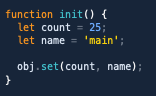

# Hivacruz Theme for Nova

A dark blue theme for Nova, that matches my [other color schemes](#other-apps).

## Other Apps

Here are the same theme for other applications:

- VSCode Theme: https://github.com/kinoute/vscode-hivacruz-theme
- Typora Theme: https://github.com/kinoute/typora-hivacruz-theme
- iTerm2: https://github.com/kinoute/hivacruz-itermcolors
- Sublime Text theme: https://github.com/kinoute/hivacruz-sublime-theme

## Credits

- Created by [Yann Defretin](https://github.com/kinoute).
- Inspired by Coda 2.5's Panic Palette by Cabel Sasser.
